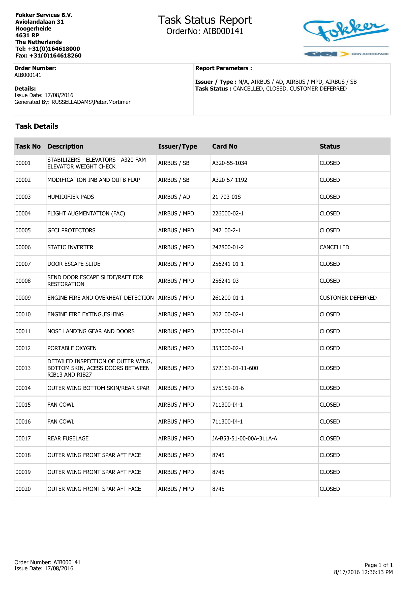

# Unlimited OCR GGUF Document Test

Isolated repository for testing `sahilchachra/Unlimited-OCR-GGUF` against local aviation/maintenance PDFs.

The tested model path is:

- `Unlimited-OCR-Q8_0.gguf`
- `mmproj-Unlimited-OCR-F16.gguf`
- DeepSeek-OCR-aware `llama.cpp` branch with `llama-mtmd-cli`

This is intentionally separate from the PaddleOCR FastAPI service.

## What This Repo Provides

- Single-page OCR runner.
- Full-PDF batch runner.
- PDF page renderer.
- Side-by-side comparison report generator.
- Setup and troubleshooting guide.
- Reference comparison reports for:
  - `TaskStatusReport`
  - `EngineData1`

## Example Output

Below is a compact example from `TaskStatusReport.pdf`. The full side-by-side review is available at [comparisons/task_status_report.html](comparisons/task_status_report.html).

<table>
  <tr>
    <th>Rendered PDF Page</th>
    <th>Extracted Table Snippet</th>
  </tr>
  <tr>
    <td width="45%">
      
      <br>
      <sub>Open the HTML report above for the full embedded page image.</sub>
    </td>
    <td width="55%">
      <table>
        <tr><th>Task No</th><th>Description</th><th>Issuer/Type</th><th>Card No</th><th>Status</th></tr>
        <tr><td>00001</td><td>STABILIZERS - ELEVATORS - A320 FAM ELEVATOR WEIGHT CHECK</td><td>AIRBUS / SB</td><td>A320-55-1034</td><td>CLOSED</td></tr>
        <tr><td>00002</td><td>MODIFICATION INB AND OUTB FLAP</td><td>AIRBUS / SB</td><td>A320-57-1192</td><td>CLOSED</td></tr>
        <tr><td>00003</td><td>HUMIDIFIER PADS</td><td>AIRBUS / AD</td><td>21-703-01S</td><td>CLOSED</td></tr>
        <tr><td>00004</td><td>FLIGHT AUGMENTATION (FAC)</td><td>AIRBUS / MPD</td><td>226000-02-1</td><td>CLOSED</td></tr>
      </table>
    </td>
  </tr>
</table>

## Quick Run

From this folder:

```bash
python scripts/batch_unlimited_ocr_pdf.py \
  --pdf ../pdf_data/TaskStatusReport.pdf \
  --llama-bin third_party/llama.cpp/build/bin/llama-mtmd-cli \
  --model models/unlimited_ocr/Unlimited-OCR-Q8_0.gguf \
  --mmproj models/unlimited_ocr/mmproj-Unlimited-OCR-F16.gguf \
  --out runs/TaskStatusReport_full \
  --dpi 200 \
  --tokens 2048 \
  --gpu-layers 5
```

Generate a visual comparison:

```bash
python scripts/generate_comparison_report.py \
  --title "Task Status Report" \
  --pages-dir runs/TaskStatusReport_full/pages \
  --ocr-dir runs/TaskStatusReport_full/ocr \
  --out comparisons/task_status_report.html
```

Open:

```text
comparisons/task_status_report.html
```

## Setup

See [SETUP_STEPS.md](SETUP_STEPS.md).
